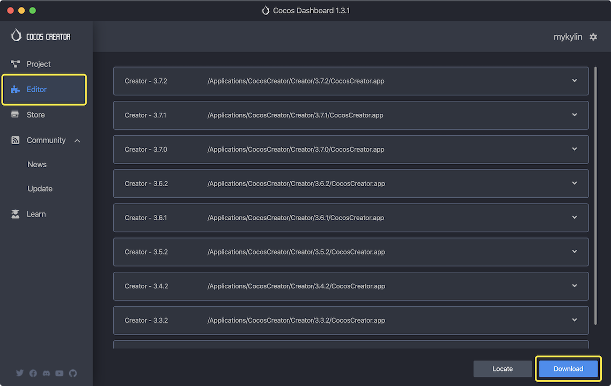
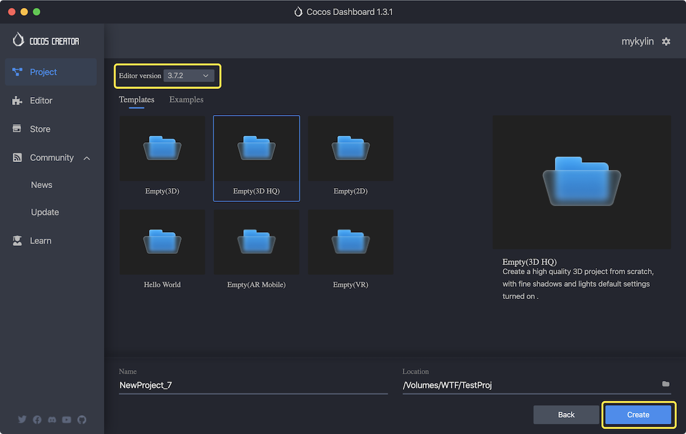

# About Cocos Creator

[Cocos Creator](https://www.cocos.com) is a cross-platform game engine used by many developers all over the world. it helps you create 2D&3D games and applications with great efficiency.

## Steps to build a game for Android in Cocos Creator

To use Cocos Creator to build your game for Android platform, please follow the following steps:

1. [Download](https://www.cocos.com/en/creator/download) and [install the Cocos Dashboard](https://docs.cocos.com/creator/manual/en/getting-started/install/).

2. Launch the **Cocos Dashboard**. Go to the **Editor** tab, click **Download** to add a version of the Cocos Creator. Note that It is highly recommended to use the latest version if possible.

3. Go to the **Project** tab, click **New** to create a new Cocos Creator project.

4. Choose an editor version, input your project name, select a location to store and then click **Create**.

5. You are good to go for creating your game!
6. [Export your game to Android](https://docs.cocos.com/creator/manual/en/editor/publish/native-options.html#build-for-android) using Project -> Build panel.

7. Compile and Generate the Android application in Android Studio.

## Notable features

### Google Play Instant

With [Google Play Instant](https://developer.android.com/topic/google-play-instant), people can use an app or game without installing it first. Increase engagement with your Android app or gain more installs by surfacing your instant app across the Play Store and Google Play Games app. To see how it works in Cocos Creator, please refer to [Publish your game as Google Play Instant app in Cocos Creator](./2-PublishAsGooglePlayInstant.md)

### Android App Bundle (AAB)

An Android App Bundle (or AAB) is a publishing format that includes all your app’s compiled code and resources, and defers APK generation and signing to Google Play. For more details, please refer to [Publish your game with Android App Bundle in Cocos Creator](./3-PublishWithAAB.md)

### Swappy

The Android Frame Pacing library, also known as Swappy, is part of the [Android Game SDK](https://android.googlesource.com/platform/frameworks/opt/gamesdk/). It helps [OpenGL](https://source.android.com/docs/core/graphics/arch-egl-opengl) and [Vulkan](https://source.android.com/docs/core/graphics/arch-vulkan) games achieve smooth rendering and correct frame pacing on Android.

Developers can easily activate Swappy in Cocos Creator by selecting the "Enable Swappy" checkbox on the build panel.

For more information, please refer to the Google document [Frame Pacing Library Overview](https://source.android.com/docs/core/graphics/frame-pacing).

### Vulkan

[Vulkan](https://source.android.com/docs/core/graphics/arch-vulkan), a low-overhead, cross-platform API for high-performance 3D graphics, is supported in Cocos Creator as one of the graphics API backends. Developers can select Vulkan as the graphics API for Android with a simple click on build panel in Cocos Creator.

## More documentations about building games for Google Play

1. [Publish your game as Google Play Instant app in Cocos Creator](./2-PublishAsGooglePlayInstant.md)
2. [Publish your game with the Android App Bundle in Cocos Creator](./3-PublishWithAAB.md)
3. [Remote Debugging your game on Android](./4-RemoteDebugging.md)

## Contact us
If you have any questions, feel free to contact us at [https://www.cocos.com/en/assistant](https://www.cocos.com/en/assistant)
