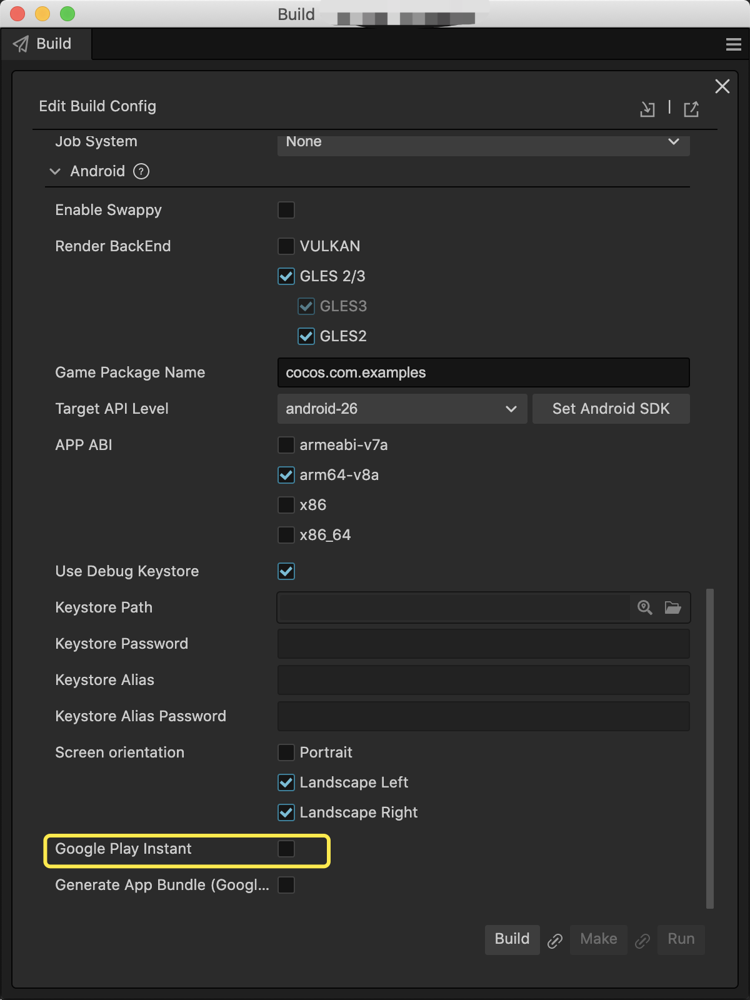

# Publish your game as Google Play Instant app in Cocos Creator

## What is Google Play Instant

With [Google Play Instant](https://developer.android.com/topic/google-play-instant), people can use an app or game without installing it first. Increase engagement with your Android app or gain more installs by surfacing your instant app across the Play Store and Google Play Games app.

## How to publish your game as Google Play Instant app

In Cocos Creator, just check the **Google Play Instant** option in the Android Build Panel. Your will then be able to publish your game with Google Play Instant ability.

## Things to be noted

However, the following points need to be noted when publishing your game as Google Play Instant app.

1. Make sure Android Studio v4.0 or above installed.

2. Google Play Instant can only be launched on devices with Android 6.0 or higher with Google Service Framework installed.

3. Before compiling in Android Studio, developers should also have downloaded and installed Google Play Instant Development SDK (for Windows) or Instant Apps Development SDK (for Mac.) If downloads were unsuccessful, it may be required to set up HTTP proxies for Android Studio.

## Contact us

If you have any questions, feel free to contact us at [https://www.cocos.com/en/assistant](https://www.cocos.com/en/assistant)
