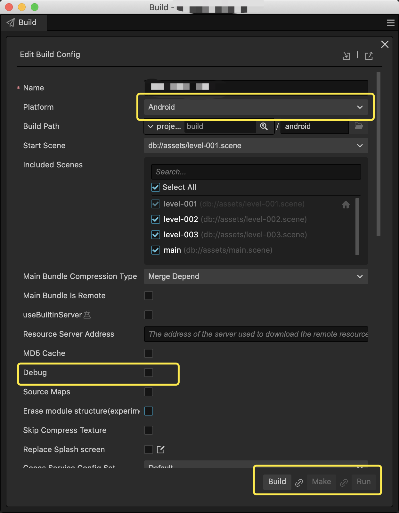
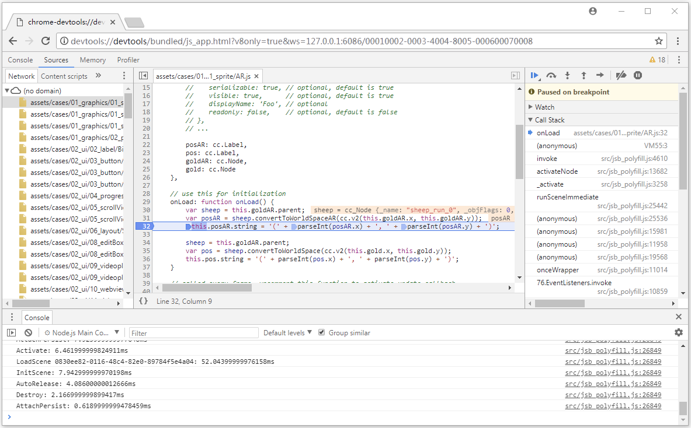

# Remote debugging on Android

Due to the differences between development and running environments, some problems only occur on specific physical devices.

At this time, remote code debugging is very important. It can help us to locate the problem quickly, save us lots of time.

Fortunately, this is very easy in Cocos Creator.

To perform remote code debugging on physical devices. Just follow the 3 steps listing below:

1. Make sure the Android device is on the same LAN as the computer that you are using to help debugging. (**Note that please do not enable proxy during debugging, otherwise the connection may fail.**)

2. Select the Android platform and check Debug mode in the Build panel of Cocos Creator, then build and run.

3. Open the Chrome devtools for remote debugging by visiting the following address in the Chrome browser, note that you will need to replace the `Device's LAN IP` with the correct mobile device's IP address, and then you can start the remote debugging on TypeScript code in your project.
    > devtools://devtools/bundled/js_app.html?v8only=true&ws=Device's LAN IP:6086/00010002-0003-4004-8005-000600070008

For more detailed instructions, you can take a look at [the official documentation](https://docs.cocos.com/creator/manual/en/editor/publish/debug-jsb.html).

## Contact us

If you have any questions, feel free to contact us at [https://www.cocos.com/en/assistant](https://www.cocos.com/en/assistant)
